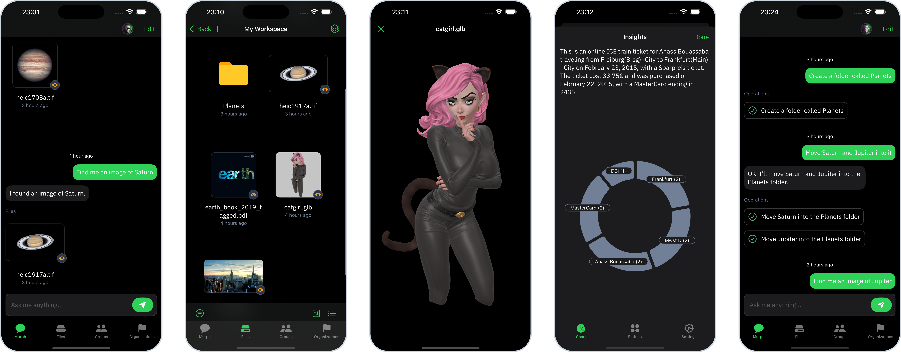

<!-- markdownlint-disable MD033 MD041 -->
<p align="center">
  
  <h1 align="center">Voltaserve for iOS</h1>
</p>

<h3 align="center">Cloud Storage for Creators</h2>

<p align="center">
  <a href="https://apps.apple.com/app/id6744360805">
    
  </a>
  <a href="https://apps.apple.com/mac/app/id6744360805">
    
  </a>
</p>

<p align="center">
  <a href="https://youtu.be/sCfvdj49WBw">▶ Talk to your files and manilulate them</a>
  <br/>
  <a href="https://youtu.be/Uf3EWb2hDfs">▶ Your creative private cloud</a>
  <br/>
  <a href="https://youtu.be/RpHp0OEa_o8">▶ iOS app walkthtough</a>
</p>

[](https://discord.gg/qYXtsMpqMR)

This is Voltaserve's iOS app, it’s fully native, optimized for iPad and iPhone, runs beautifully on the Mac, features a slick user interface with real-time updates, and is built using Apple’s flagship framework, SwiftUI.



## Usage

- Make sure your Voltaserve instance is up and running, or follow the instructions [here](https://github.com/kouprlabs/voltaserve) to create a new instance.
- Install the app on your device with Xcode.
- On the sign in screen, in the upper right corner, click the cog button to create a new server that points to the URLs of your instance, **then activate it**, example URLs:
  - API: `http://localhost:8080`
  - Identity Provider: `http://localhost:8081`
- Sign in and enjoy!

## Getting Started

Prerequisites:

- Install [Xcode](https://developer.apple.com/xcode/).
- Install [SwiftLint](https://github.com/realm/SwiftLint).

This is a Swift package, it can be installed using the [Swift Package Manager](https://www.swift.org/documentation/package-manager/) and imported in your code.

The clients in [Sources/Clients](./Sources/Clients) can be used to communicate with Voltaserve APIs.

The extensible `Voltaserve` SwiftUI view can be used to embed the entire UI in your apps:

```swift
import SwiftUI
import VoltaserveCore

@main
struct MyApp: App {
    var body: some Scene {
        WindowGroup {
            Voltaserve()
        }
    }
}
```

Format code:

```shell
swift format -i -r .
```

Lint code:

```shell
swift format lint -r .
```

```shell
swiftlint lint --strict .
```

## Tests

The test suite expects the following accounts to exist:

| Email            | Password    |
| ---------------- | ----------- |
| test@koupr.com   | `Passw0rd!` |
| test+1@koupr.com | `Passw0rd!` |

Build and run with Docker:

```shell
docker build -t voltaserve/ios-tests . && docker run --rm \
    -e API_HOST=host.docker.internal \
    -e IDP_HOST=host.docker.internal \
    -e USERNAME='test@koupr.com' \
    -e PASSWORD='Passw0rd!' \
    -e OTHER_USERNAME='test+1@koupr.com' \
    -e OTHER_PASSWORD='Passw0rd!' \
    voltaserve/ios-tests
```

In Linux you should replace `host.docker.internal` with the host IP address, it can be found as follows:

```shell
ip route | grep default | awk '{print $3}'
```

## Licensing

Voltaserve is released under the [Business Source License 1.1](LICENSE).
